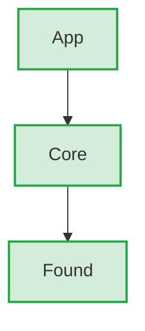
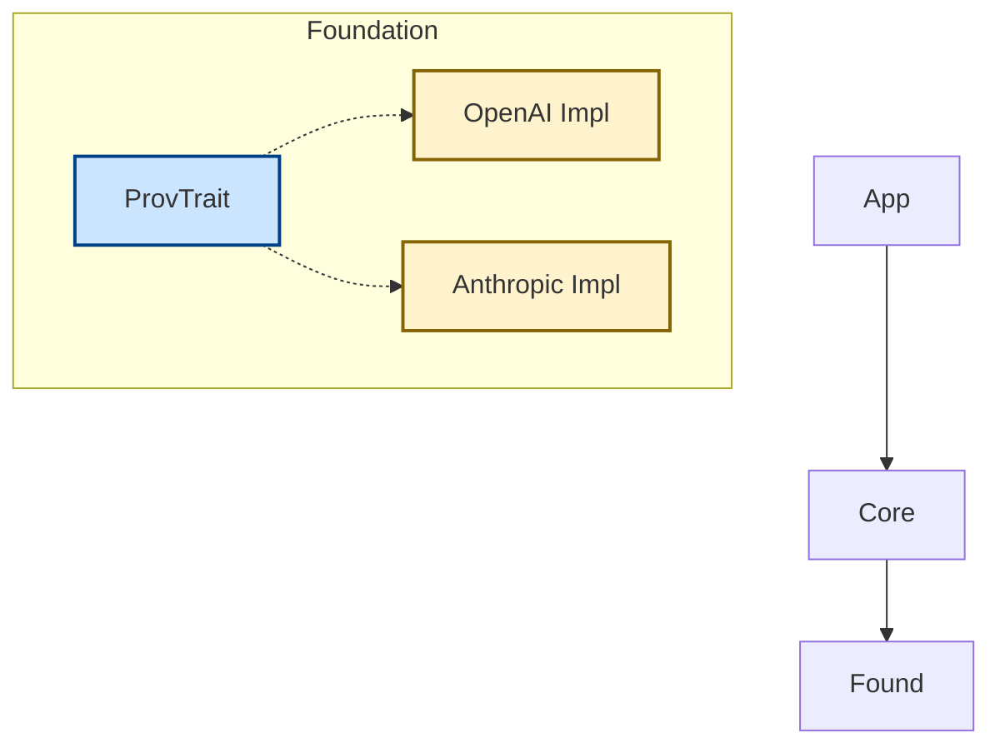
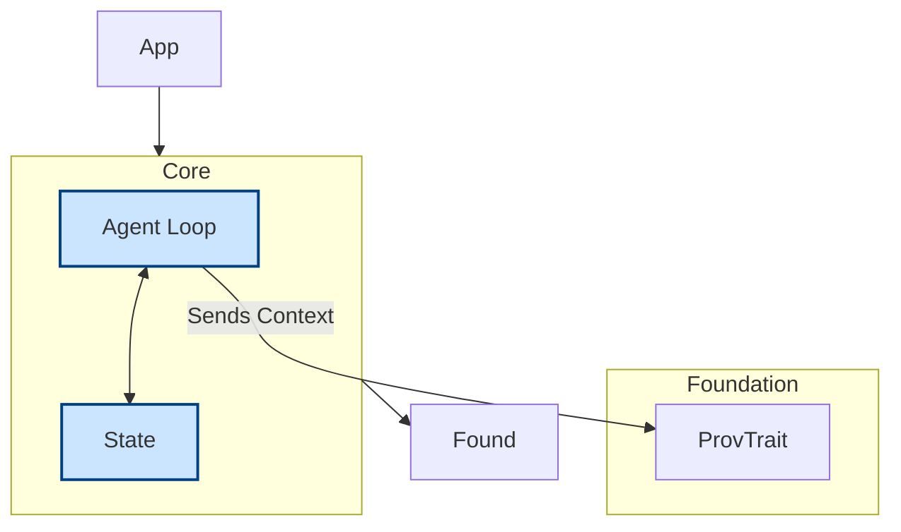
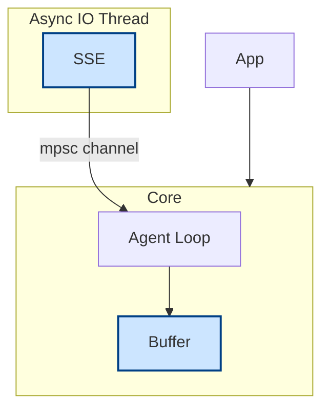
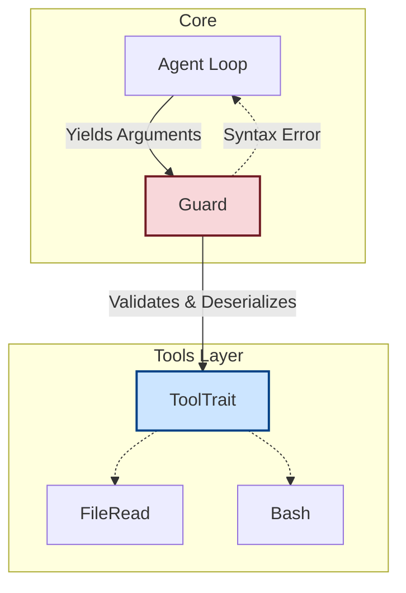
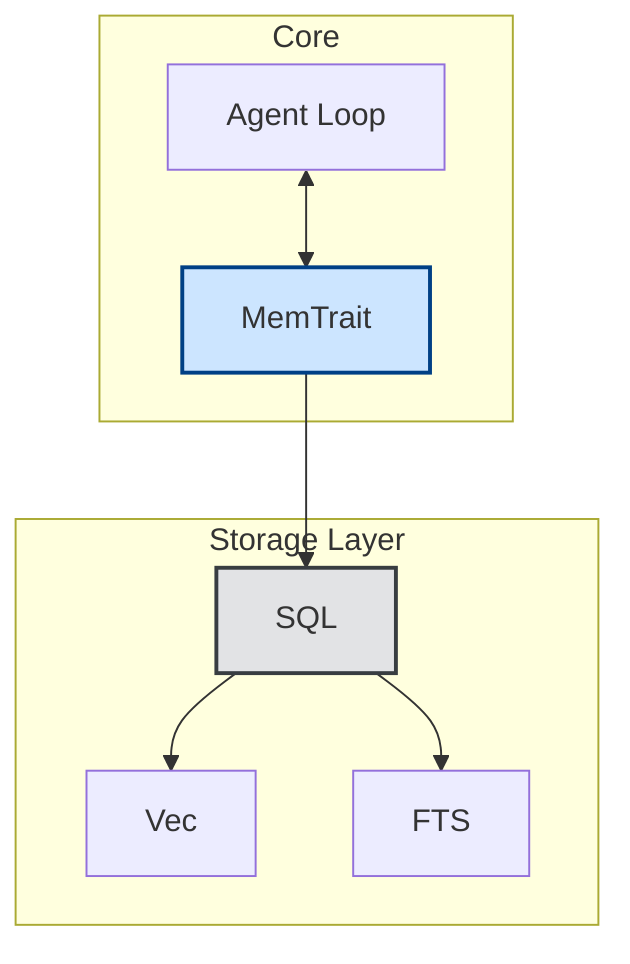
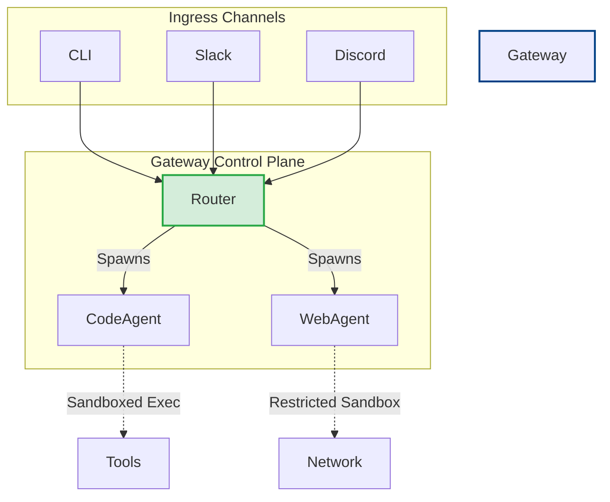

# Architecting a High-Performance, Minimalist AI Agent Orchestrator in Rust

**A Progressive Systems Engineering Guide**

---

## Table of Contents

1. Introduction
2. Chapter 1: The Minimal Core Philosophy and Progressive Monorepo Architecture
3. Chapter 2: The Unified Provider Abstraction and Trait Dispatch
4. Chapter 3: The Agent Runtime and Turn-Based State Machine
5. Chapter 4: Asynchronous Streaming and Input Output Mechanics
6. Chapter 5: Tool Calling, Procedural Macros, and Schema Validation
7. Chapter 6: Conversational Memory and Vector State Persistence
8. Chapter 7: Capability-Based Security and OS-Level Sandboxing
9. Chapter 8: Multi-Agent Orchestration, Routing, and The Gateway Pattern
10. Conclusion

---

## Introduction

The transition from monolithic, script-based artificial intelligence applications to highly scalable, autonomous agent orchestrators represents a fundamental paradigm shift in software architecture. Early implementations of agentic systems relied heavily on dynamic languages, primarily Python and TypeScript, prioritizing rapid prototyping and ecosystem availability over execution efficiency. Frameworks such as OpenClaw demonstrated the immense potential of personal AI assistants, moving beyond simple chatbots to entities capable of persistent memory, multi-channel presence, proactive background task execution, and autonomous software development.[1, 2] OpenClaw transformed agentic capabilities from research artifacts into deployable digital teammates, characterized by users as an "iPhone moment" for its ability to automate tasks across inboxes, calendars, and integrated development environments.[2, 3]

However, as these systems scale to handle multimodal streams, complex multi-agent routing, and concurrent tool execution, the overhead of heavily abstracted runtime environments becomes a critical architectural bottleneck. In an ecosystem where a single TypeScript-based agent runtime can consume over 1 gigabyte of random access memory and require upwards of 500 seconds for complex cold starts, transitioning to a systems-level language becomes an operational imperative.[4] Constructing a highly concurrent, memory-safe, and dynamically extensible agent orchestrator in Rust offers profound advantages in both cost and performance. Systems like ZeroClaw have proven that an entire AI agent infrastructure can be condensed into a 3.4-megabyte compiled binary capable of executing with less than 5 megabytes of memory overhead and a cold start latency of under 10 milliseconds.[5, 6] This lean architecture enables deployment on hardware as constrained as a $10 single-board computer, making it 98 percent cheaper to operate than traditional heavy runtimes.[4, 6]

Achieving this requires a rigorous, progressive architectural strategy. Rather than attempting to construct a monolithic framework in a single iteration—a process prone to architectural drift and unmaintainable coupling—the system must be built layer by layer. This approach adheres strictly to the "small core" philosophy demonstrated by architectures like the Pi-mono monorepo, where the intentional omission of bloated features forces the agent to rely on a minimal set of highly optimized, generalized capabilities to extend itself dynamically.[2, 7] By isolating the foundational language model abstractions, constructing a minimal agent loop, engineering kernel-level sandboxing, and finally multiplexing through a centralized gateway, one can develop an orchestrator that is secure by design, infinitely extensible, and capable of deep multi-agent collaboration without succumbing to technical debt.

---

## Chapter 1: The Minimal Core Philosophy and Progressive Monorepo Architecture

The foundational philosophy of a robust, production-grade agent orchestrator is rooted in intentional reduction. The Pi agent architecture avoids hardcoding expansive toolsets and protocol-specific integrations into the core runtime, including standards such as MCP.[2] This omission is not developmental oversight; it is a deliberate design choice to keep the core minimal and extensible. The philosophy dictates that if an agent requires new capabilities or integrations, the user should not simply download a pre-compiled extension or skill.[2] Instead, the user should instruct the agent to extend itself, leveraging the innate code-generation proficiencies of large language models to write, execute, and persist new capabilities at runtime.[2]

To successfully implement this philosophy in a Rust environment, the architecture must be progressively constructed using a strict, enforced dependency hierarchy. Utilizing Cargo workspaces, the repository should adopt a layered structure inspired by Pi-mono's conceptual dependency boundaries while remaining idiomatic to Rust crate design.[7, 8] This monorepo design ensures that the lowest foundational packages contain zero internal dependencies, the core logic packages depend exclusively on the foundations, and the high-level orchestration routing applications depend only on the core.[7]

| Architectural Layer | Crate / Package | Scope | Dependency Constraint | Core Responsibility |
|---|---|---|---|---|
| Foundation | `types` | Zero internal dependencies | Defines universal message/tool/context structs, base traits, config schema structs, and shared error primitives. |
| Core | `provider`, `tools`, `tools-macros`, `runtime`, `memory`, `sandbox` | Depends strictly on Foundation | Implements provider adapters, tool execution, turn loop, persistence, and sandbox boundaries. |
| Application | `channels`, `gateway`, `cli` | Depends on Core and Foundation | Manages ingress/egress channels, routing daemon, and operator interfaces. |

By enforcing these boundaries at the compiler level, the orchestrator's core runtime remains entirely decoupled from specific communication channels, terminal user interfaces, or external application programming interfaces. This separation allows a developer to focus on the stability of the abstraction layer before attempting to route multi-agent conversations. Furthermore, it supports the Pi philosophy of providing the shortest viable system prompt alongside a highly restricted toolset—specifically Read, Write, Edit, and Bash.[2, 7] By providing only these four primitives, the agent is granted full Turing-complete control over its environment, relying on its internal understanding of command-line tools to navigate the host system rather than requiring the developer to hardcode specialized Rust traits for every conceivable operation.[7]

### Entities to Implement

- **Cargo Workspace Root:** Define `[workspace]` in the root `Cargo.toml` and declare all crates explicitly.
- **Configuration Module (`types::config`):** Define typed config structs and defaults shared across runtime, provider, and gateway crates.
- **Error Hierarchy:** Define per-crate `thiserror` enums and compose them upward (`RuntimeError` wrapping provider/tool/memory failures).
- **Layered Crates:** Initialize `types`, `provider`, `tools`, `runtime`, `memory`, `sandbox`, `channels`, `gateway`, and `cli` from day one to avoid structural rewrites later.

### Architecture Diagram So Far



### Implementation Hints

- Enforce the dependency graph strictly during your build process. If your foundation layer accidentally imports tokio filesystem utilities meant for the application layer, you have broken the separation of concerns.
- Treat pi-mono as a conceptual reference (layering, minimal core), but implement the design natively with Cargo workspaces.[7]
- Add `cargo deny` and feature-gated builds in CI to keep optional capabilities (`gateway`, channel adapters, MCP, OpenTelemetry) out of early phases.

### Configuration Management Strategy (Foundational)

Configuration must be deterministic and auditable from the first milestone. Use one layered loader (`config` or `figment`) with a single precedence order:

1. Built-in defaults in code
2. System config (`/etc/oxydra/agent.toml`, `/etc/oxydra/providers.toml`)
3. User config (`~/.config/oxydra/agent.toml`, `~/.config/oxydra/providers.toml`)
4. Workspace overrides (`./.oxydra/agent.toml`, `./.oxydra/providers.toml`)
5. Environment overrides (for example `OXYDRA__RUNTIME__MAX_TURNS`)
6. CLI flags (highest precedence)

Each file should include a `config_version` field and must be validated at startup (typed deserialization + schema checks). Startup should fail fast on invalid configuration to avoid undefined runtime behavior. Credentials should resolve consistently as: explicit config `api_key` -> provider-specific environment variable (`ANTHROPIC_API_KEY`, `OPENAI_API_KEY`, `GEMINI_API_KEY`) -> generic `API_KEY` fallback (development only). Secrets must never be printed in logs or trace spans.

### Finalized Design Decisions

- Pi-mono is used as a conceptual reference only; this proposal is explicitly a Rust/Cargo architecture.
- Workspace boundaries are enforced with CI policy (`cargo deny`) and capability feature flags to keep early phases minimal.
- Configuration and error hierarchy are now foundational concerns, not deferred concerns.

### Considerations

- Standardize on either `config` or `figment` by implementation kickoff to avoid divergent precedence behavior.

---

## Chapter 2: The Unified Provider Abstraction and Trait Dispatch

The initial phase of development must focus entirely on the communication boundary between the orchestrator and the external AI models. A naive approach involves writing hardcoded HTTP requests for specific inference APIs, which inherently locks the system into a single provider and severely limits operational flexibility. Instead, the foundation must establish a unified multi-provider abstraction layer, akin to the pi-ai implementation, which normalizes disparate wire protocols into a singular, cohesive internal representation.[7, 8]

### Normalizing Wire Protocols

Despite the proliferation of over 22 distinct AI providers—including OpenAI, Anthropic, Google Gemini, Ollama, and DeepSeek—the underlying data exchange generally adheres to a limited set of conceptual wire protocols.[4, 5] By isolating these protocols, the Rust implementation can map any external API to a universal, portable schema. The abstraction layer is responsible for converting the orchestrator's internal `Message` and `ToolCall` structs into the specific JSON payloads expected by the provider.[9]

#### Type-First Model Identity and Capability Registry

Model and provider selection should be type-first, not string-first. Avoid carrying model names as free-form `String` values across runtime boundaries; instead define strongly typed identifiers such as `ModelId`, `ProviderId`, and `ModelDescriptor`. A generated model catalog (for example from a pinned models.dev snapshot, as done conceptually in pi-mono) should be used to populate capability and policy metadata (`supports_tools`, `supports_streaming`, token limits, pricing, deprecation state). Runtime and configuration code should validate model selection against this catalog at startup so unknown or malformed model identifiers fail fast before execution.

For instance, OpenAI and Ollama utilize the standard `/v1/chat/completions` endpoint, which translates natively to internal representations.[7] In contrast, Anthropic's Claude relies on a `/v1/messages` block structure that interleaves text and tool-use blocks, requiring the abstraction layer to flatten these elements into standardized turns.[7] Google's Generative AI operates on a proprietary `parts` array within its `/v1beta/models/{model}:generateContent` endpoint, demanding custom structural translation.[7] Furthermore, the abstraction layer must internally manage the specific idiosyncrasies of each provider, such as mapping variations in token limitation parameters, managing the absence of native tool-call streaming in specific endpoints, and normalizing "thinking" or reasoning traces across different inference engines.[7] The output of this layer is a catalog of context objects that are entirely serializable, allowing the orchestrator to dynamically switch providers mid-session while preserving the conversation history and cognitive trace.[7, 10]

#### Supporting the OpenAI Responses API Format

Beyond the standard `/v1/chat/completions` endpoint, the abstraction layer must also account for OpenAI's **Responses API** (`/v1/responses`), a newer stateful inference format introduced to support richer agentic workflows. Unlike the chat completions endpoint—which is stateless and requires the client to transmit the full conversational history on every request—the Responses API persists conversation state server-side via a `previous_response_id` chaining mechanism. This fundamentally alters how the provider implementation manages context.

The Responses API introduces several structural differences that the provider abstraction must normalize:

- **Stateful session chaining:** Rather than re-sending the full `messages` array, each subsequent turn references the prior turn's `response.id`. The `ResponsesProvider` implementation must track this identifier in session state and inject it as `previous_response_id` in the request body.
- **Input array format:** The Responses API accepts an `input` array of typed content items (e.g., `input_text`, `input_image`) rather than a flat `messages` array, requiring a dedicated serialization path in the provider's request builder.
- **Built-in tool declarations:** The Responses API supports first-class built-in tools such as `web_search` and `file_search` declared directly in the request payload, distinct from the `functions` schema used by chat completions. The abstraction layer must map the orchestrator's internal `ToolDecl` structs to the appropriate format depending on the active endpoint.
- **Output item parsing:** Responses are returned as a structured `output` array of typed items (e.g., `output_text`, `tool_call`, `reasoning`), rather than a flat `choices[0].message` structure. The provider implementation must iterate these items and flatten them into the orchestrator's internal `Response` representation.
- **Streaming via SSE:** Like chat completions, the Responses API supports streaming via Server-Sent Events, but emits distinct event types such as `response.output_item.added` and `response.output_text.delta`, requiring a separate SSE parser branch in the async streaming layer covered in Chapter 4.

When implementing the `ResponsesProvider` struct, the provider's `complete` method should detect whether a live `previous_response_id` exists in the current session context. If one is present, it omits the full message history and instead chains the response, drastically reducing token transmission overhead for long multi-turn sessions. This server-side state management capability makes the Responses API particularly well-suited for multi-agent subagent delegation patterns described in Chapter 8, where spawning a new subagent with a fresh `response_id` chain provides clean context isolation without duplicating memory payloads.

### Static versus Dynamic Dispatch in Trait Architecture

In Rust, exposing the extension surface for providers, channels, and tools requires a sophisticated architectural approach to trait implementations. The orchestrator must define a `Provider` trait that standardizes inference execution, alongside corresponding traits for `Channel`, `Tool`, and `Memory` subsystems.[5] When designing these traits, the systems architect must evaluate the trade-offs between static dispatch and dynamic dispatch.[11]

Static dispatch utilizes generic boundaries, requiring the compiler to duplicate the function for every distinct type passed to it and resolving the exact memory address of the function at compile time.[11] This zero-cost abstraction eliminates runtime overhead and enables aggressive compiler optimizations, such as inlining.[11, 12] However, an agent orchestrator fundamentally requires heterogeneous collections. A gateway router may need to maintain an active registry of multiple subagents, each utilizing a different provider model simultaneously to optimize costs. In a strictly statically dispatched system, attempting to store these models in a vector mandates that the generic type resolves to a single underlying provider at compile time, preventing the mixing of an OpenAI provider and a local Llama provider within the same active registry.[11]

Consequently, the core architecture must leverage dynamic dispatch via trait objects, utilizing syntax such as `Box<dyn Provider + Send + Sync>`. Dynamic dispatch introduces a "fat pointer" comprising a pointer to data and a pointer to the virtual method table for that specific type.[11] At runtime, the system consults the vtable to locate the correct function address before executing the jump instruction.[11] While this incurs a marginal cost, it is the mechanism that enables plug-and-play provider registries and live provider switching.[5, 11] On stable Rust, `async fn` in traits is still not `dyn`-compatible for this use case, so the production-safe pattern is to define async trait boundaries with `#[async_trait]` (or an equivalent erasure crate) and keep strict `Send`/`Sync` bounds for multi-threaded runtimes.

### Entities to Implement

- **`Message` and `ToolCall` Structs:** Universal internal representations.
- **`Provider` Trait:** Async trait boundary via `#[async_trait]` with `complete`, `stream`, and `capabilities` methods returning `ProviderError`.
- **`ProviderCaps` Struct:** Declares feature support (`supports_streaming`, `supports_tools`, `supports_json_mode`, `supports_reasoning_traces`, token limits, and cost metadata).
- **`ModelId` / `ProviderId` Newtypes:** Typed identifiers replacing free-form string model selection in runtime interfaces.
- **`ModelCatalog` Registry:** Build-time or startup-loaded catalog of valid models and capabilities (for example from pinned models.dev data).
- **Provider Implementations:** Create `OpenAIProvider`, `AnthropicProvider`, `GeminiProvider`, `ResponsesProvider`, etc., that implement the trait.
- **`ProviderRouter` / `ReliableProvider`:** Wrapper layer for retries, exponential backoff, and fallback chains.

### Architecture Diagram So Far



### Implementation Hints

- Avoid tying internal `Message` structs strictly to one vendor; keep OpenAI, Anthropic, and Gemini wire mappings in provider-specific serializers.[7]
- Prefer typed model identifiers and validated descriptors over raw model-name strings in config, routing, and provider selection paths.
- Normalize tool declarations via a `ToolsPayload` enum so each provider receives its native format while the runtime stays provider-agnostic.
- Resolve credentials in the provider initialization path using the global precedence chain (explicit config -> provider env var -> generic fallback).
- Wrap each concrete provider in a `ReliableProvider` to handle retries, backoff, and fallback routing before surfacing failures to runtime.
- Keep `previous_response_id` in session state for Responses API chaining to reduce repeated token transmission in long sessions.
- If evaluating external crates such as `genai` or `rig-core`, keep them behind adapter structs implementing internal traits so no external types leak into runtime APIs.

### Finalized Design Decisions

- Provider traits are defined for stable Rust dynamic dispatch using `#[async_trait]` and `Box<dyn Provider + Send + Sync>`.
- `ProviderCaps` and `ToolsPayload` normalization are required to adapt behavior per vendor without leaking vendor-specific assumptions into runtime.
- Model selection is type-checked through internal model/provider identifiers and validated against a model capability catalog.
- Provider reliability (retry, backoff, fallback) is part of the provider layer contract, not an afterthought.
- Credential lookup uses deterministic 3-tier resolution in provider initialization.

### Considerations

- `dynosaur` or manual future erasure can be explored later if profiling shows `#[async_trait]` overhead matters.
- Decide update cadence and pinning policy for external model-catalog sources (for example models.dev snapshots) to balance freshness and reproducibility.

---

## Chapter 3: The Agent Runtime and Turn-Based State Machine

With the provider abstraction solidified, the second progressive layer involves constructing the central nervous system of the orchestrator: the agent loop. The pi-agent-core package exemplifies this minimalist design by avoiding complex built-in planning heuristics in favor of a straightforward, deterministic cycle.[7] The runtime logic shifts the burden of cognitive progression entirely to the language model, relying on robust state management within the Rust binary to facilitate execution.[13]

### The Minimal Turn-Based Cycle

The execution loop initiates by submitting the unified context payload to the dispatched `Provider` trait and listening for a streamed response. The cycle streams generated tokens to the client, evaluates completion payloads for tool calls, and terminates the turn when no tools are requested.[7] If tool calls are detected, the loop suspends text generation, executes side-effecting tools sequentially and safe read-only tools in parallel, appends normalized tool results to context, and recursively re-invokes the provider. Every turn runs under cancellation, timeout, and budget guards.

This turn-based mechanism is robust because it is deterministic and explicit. The runtime should still enforce non-negotiable operational guards: per-turn timeout, max-turn budget, and max-cost budget to prevent runaway loops. If the language model requires a complex planning phase, it can externalize that plan through tools without introducing hidden planner heuristics into the core executor.[7]

### Hierarchical State Management

To support more complex agentic behaviors without bloating the core loop, the orchestrator should implement a hierarchical state machine pattern, comparable to the designs found in the `ai-agents-memory` crate.[13] This involves mapping nested sub-states where each state can inherit prompts from its parent.[13] Transitioning between states relies on evaluated conditions, allowing the orchestrator to short-circuit execution based on predefined guardrails.[13] When the agent transitions from a "planning" state to an "execution" state, the Rust state machine triggers entry and exit actions—such as automatically executing a specific setup tool or refreshing the context window—ensuring that the agent operates within strictly defined behavioral corridors.[13] This declarative pipeline approach allows developers to define extraction, validation, and transformation logic independently of the raw inference loop.[13]

### Entities to Implement

- **`TurnState` Enum:** Represents the current phase of the agent (e.g., `Streaming`, `ToolExecution`, `Yielding`).
- **`AgentRuntime` Struct:** Holds `Box<dyn Provider>`, tool registry, context state, and runtime guards.
- **Runtime Guards:** `CancellationToken`, turn timeout, max-turn, and max-cost enforcement.
- **Telemetry Spans:** Structured `tracing` spans for turn lifecycle, provider calls, and tool execution.[7]

### Architecture Diagram So Far



### Implementation Hints

- Keep the loop deterministic; do not add heuristic "guessing" branches for completion semantics.
- Add provider and tool retry policies with bounded attempts, then escalate to human-in-the-loop when failure thresholds are exceeded.
- Instrument the loop with `#[instrument]` spans from day one so traces can be exported directly to OpenTelemetry later.
- Model sessions as trees rather than linear arrays.[2] This allows side-quests to branch off and collapse back without destroying the primary context.

### Finalized Design Decisions

- Runtime now explicitly includes cancellation, timeout, max-turn, and max-cost guards.
- Parallel tool execution is supported for safe/read-only tools; side-effecting tools remain sequential by default.
- `tracing` instrumentation is treated as core runtime infrastructure from the first implementation phase.

### Considerations

- A typestate-based loop can replace the enum-based state machine after behavioral stability if stronger compile-time guarantees are needed.

---

## Chapter 4: Asynchronous Streaming and Input Output Mechanics

Handling streaming responses from language models in Rust introduces significant complexities regarding asynchronous input/output management. The response from the provider must be treated as a continuous flow of data chunks transmitted via Server-Sent Events.[14] Rust's asynchronous ecosystem, while immensely powerful, presents competing paradigms for stream handling, demanding careful architectural selection.

### Navigating the Stream and AsyncRead Traits

The fundamental choice in handling incoming tokens lies between the `Stream` trait and the `AsyncRead` trait.[15] The `Stream` trait defines a low-level interface that effectively combines the mechanisms of iterators and futures, allowing developers to utilize higher-level utilities provided by `StreamExt`, such as the asynchronous `.next()` method.[34] Conversely, the `AsyncRead` trait mirrors traditional synchronous reading by operating on byte buffers, with variations existing between the standard futures implementation and the tokio runtime implementation.[15]

In a high-throughput orchestrator designed to manage concurrent multi-agent communications, blocking operations are catastrophic to the event loop. The implementation must utilize asynchronous message passing, typically via `tokio::sync::mpsc` channels.[16] The architecture spawns an isolated asynchronous task that maintains the HTTP connection with the provider, parsing the incoming SSE payload as the network delivers chunks.[14] Each parsed delta—whether a fragment of natural language or a partial JSON tool-call argument—is transmitted through the sender channel. The primary agent loop acts as the receiver, yielding these chunks to the connected user interfaces or accumulating them into an internal buffer to reconstruct complete tool arguments before execution.[16]

### Waker Mechanics and Dynamic Dispatch Constraints

A critical, low-level nuance of Rust's asynchronous stream polling is the management of the `Waker` mechanism. The `Future` poll cycle uses a `Waker` to resume suspended tasks once network or parser state changes.[17] For practical orchestrator architecture, this reinforces two implementation choices: keep provider streaming adapters object-safe at runtime boundaries, and isolate stream parsing in dedicated tasks communicating over bounded channels. This avoids backpressure collapse while preserving modular provider implementations.

### Entities to Implement

- **Bounded `tokio::sync::mpsc::Sender` / `Receiver`:** Use bounded channels to pass parsed stream chunks with backpressure.
- **`StreamItem` Enum:** Include `Text`, `ToolCallDelta`, `ReasoningDelta`, `UsageUpdate`, `ConnectionLost`, and `FinishReason`.
- **Tool Chunk Accumulator:** Reconstruct fragmented JSON arguments safely before validation, including escaped sequences and split unicode fragments.[35]

### Architecture Diagram So Far



### Implementation Hints

- Use bounded `mpsc::channel(N)` to apply natural backpressure when downstream consumers are slower than provider streams.
- Implement reconnect/resume behavior for providers that support resumable streams; otherwise emit `ConnectionLost` so runtime can retry the turn.
- Tool chunks arrive heavily fragmented. The accumulator must safely handle partial escapes, partial unicode, and concurrent multi-tool deltas before validation.
- Emit real-time usage deltas during streaming to power cost and budget enforcement.

### Finalized Design Decisions

- Streaming is implemented with bounded channels to enforce backpressure under slow consumers.
- Connection resilience is explicit: reconnect/resume where supported, otherwise emit structured loss events for runtime policy.
- Stream parsing includes reasoning and usage deltas to support observability and budget enforcement.

### Considerations

- Choose between standard `serde_json` incremental parsing and SIMD-accelerated parsers based on measured throughput requirements.

---

## Chapter 5: Tool Calling, Procedural Macros, and Schema Validation

An autonomous agent is only as effective as the environment it can manipulate. The fourth progressive layer establishes the `Tool` trait, enabling the orchestrator to execute concrete programmatic actions.[5] Implementing tool calling securely and reliably requires bridging the strongly typed, compiled domain of Rust with the inherently loosely structured JSON generation of probabilistic language models.

### Automatic JSON Schema Generation

To inform the language model of its capabilities, the orchestrator must supply strictly formatted JSON schemas detailing the available tool names, descriptions, and required arguments.[9] Manually defining and maintaining these JSON structures alongside the corresponding Rust functions is highly prone to architectural drift, where the documentation diverges from the actual executable code.

The optimal architectural pattern employs Rust procedural macros to automate this synchronization, leveraging concepts demonstrated by crates such as `tools-rs`.[19] By applying a custom attribute macro (e.g., `#[tool]`) to an asynchronous Rust function, the compiler can automatically derive the necessary metadata during the build process.[18, 19] This involves parsing the function signature, mapping Rust primitives and custom structs to their JSON Schema equivalents, and extracting doc-comments to formulate the tool's descriptive payload.[19] This ensures that the generated `FunctionDecl` schema supplied to the model is in perfect, type-safe synchronization with the binary's actual capabilities.[19]

### Validation and Self-Correction Loops

Despite explicit schema declarations, language models frequently generate non-compliant JSON payloads. Errors manifest as missing required fields, hallucinated parameters, incorrect data types, or failure to escape internal quotation marks.[20] If the orchestrator naively attempts to deserialize this malformed output into a Rust struct, the operation will panic or return a fatal error, terminating the agent's execution loop.

To mitigate this systemic fragility, the orchestrator must implement an aggressive in-process validation layer using Rust-native tooling (`schemars`/`tools-rs` for schema generation, `jsonschema` + `serde_json` for validation and decoding).[20] When the agent yields a tool call, arguments are buffered and validated against the expected Rust type signature.[19] If validation fails, the orchestrator does not crash. Instead, it captures the specific decoding/validation error, formats it as a structured tool-result error, and injects it back into conversation context for model self-correction.[7] This pattern transforms a fatal runtime failure into a recoverable iteration step, significantly improving reliability in long multi-step workflows.

### Entities to Implement

- **`dyn Tool` Trait:** Requires `fn schema(&self) -> FunctionDecl`, `async fn execute(&self, args: &str) -> Result<String, ToolError>`, `fn timeout(&self) -> Duration`, and `fn safety_tier(&self) -> SafetyTier`.
- **`#[tool]` Procedural Macro:** Macro crate to auto-generate function schemas from Rust signatures and docs.[19]
- **Validation Guard:** Uses `jsonschema` + `serde_json` to catch malformed arguments and return structured correction payloads.[20]
- **Tool Registry Policy Layer:** Enforces timeout, output-size truncation, and HITL gates by safety tier before results are appended to context.

### Architecture Diagram So Far



### Implementation Hints

- Keep baseline tools minimal: `Read`, `Write`, `Edit`, and `Bash` are sufficient for full environmental manipulation.[2]
- Enforce a mandatory timeout at registry level for every tool invocation.
- Truncate oversized tool output before context injection and include a clear truncation notice with original byte count.
- If an LLM yields a hallucinated parameter, include the violated schema fragment and decoder error to maximize self-correction quality.
- Keep the `Tool` trait MCP-compatible so `McpToolAdapter` can be added without changing native tool signatures.

### Finalized Design Decisions

- Tool validation uses Rust-native schema tooling (`schemars`/`tools-rs`, `jsonschema`, `serde_json`) in-process.
- Registry-level policy enforces timeout, output-size limits, and safety-tier gating uniformly across all tools.
- Tool trait design remains MCP-compatible to support future external tool registries without redesign.

### Considerations

- Keep procedural macros focused on schema generation; avoid embedding runtime policy logic in macro expansions.

---

## Chapter 6: Conversational Memory and Vector State Persistence

An orchestrator managing continuous, multi-turn, multi-agent workflows requires an unyielding state management system. In-memory data structures are entirely insufficient for long-running daemon processes that may be interrupted, restarted, or required to context-switch between hundreds of concurrent user sessions. The `Memory` trait must persist conversational state, tool results, and semantic context reliably across the host machine's filesystem.[5]

### Embedded libSQL and Hybrid Retrieval

While heavy standalone vector databases—such as Pinecone, Qdrant, or Weaviate—are prevalent in enterprise architectures, they require complex containerization, networking overhead, and HTTP serialization that severely violate the orchestrator's constraints of being local-first and minimally resourced.[21] The architectural solution is to embed a two-tier database directly into the Rust binary, leveraging libSQL (SQLite-compatible, Turso-backed) in local mode with optional remote connectivity for shared deployments.[22, 23]

The schema design for this highly optimized memory architecture necessitates distinct, synchronized tables to support hybrid retrieval techniques.[22]

- A `files` table tracks the physical location, content hashes, and modification times of ingested context documents to prevent redundant indexing.[22]
- A primary `chunks` table serves as the source of truth, storing the raw text data, JSON-serialized metadata, and exact line ranges for localized extraction.[22]
- A `chunks_vec` table stores binary float vectors generated by a local embedding model, using libSQL/Turso vector capabilities to enable rapid nearest-neighbor similarity searches without special extension loading.[22]
- A `chunks_fts` virtual table, utilizing libSQL's SQLite-compatible FTS5 support, indexes the raw text to provide exact keyword searches and token matching.[22]

This structure empowers the agent with true hybrid retrieval capabilities. When an agent queries long-term memory, the orchestrator executes cosine similarity search on vectors and BM25 scoring on FTS5 in parallel, then merges results with a weighted ranker.[4, 22] For production readiness, embedded libSQL should remain the default path because it preserves local-first portability while aligning with Turso-hosted deployments. Optional Turso remote mode can be enabled by configuration when replication/shared access is required, without changing the `Memory` trait contract.

### Rolling Summarization and Context Constraints

Continuous conversational persistence inevitably encounters the maximum context window limitation of the underlying language model. To maintain state indefinitely without triggering context collapse, the Memory subsystem must implement rolling summarization and token budgeting strategies.[13] As the session size crosses a predefined token ratio threshold—for example, exceeding 85 percent of the model's maximum capacity—the system must proactively trigger a background compression task.[24]

An asynchronous inference call is dispatched using a specialized summarizer prompt. It digests older conversational nodes, extracts key facts, and updates synthesized long-term memory while truncating raw logs.[13, 24] The summarization trigger threshold should be configurable per model (not hardcoded), and updates must be race-safe (for example via context epoch checks or lock-guarded writes) so a newer turn is never overwritten by stale summarizer output.[25] Structuring sessions as hierarchical trees further allows side-quests to branch and merge cleanly without polluting primary context windows.[2]

### Entities to Implement

- **`Memory` Trait:** Abstraction containing `store`, `recall`, and `forget` methods.
- **Embedded libSQL DB:** `libsql` + versioned SQL migrations (for example `refinery`) for durable schema evolution.
- **Embedding Pipeline:** Local-first embedding generation (for example `fastembed-rs`) with optional API-based providers behind feature flags.
- **Context Budget Manager:** Tracks model-specific token budgets (`system + memory + history + tools + safety buffer`) and triggers summarization by configurable thresholds.[24]
- **Background Summarizer:** Async task with race protection (epoch or lock strategy).

### Architecture Diagram So Far



### Implementation Hints

- Instead of a separate vector database server, use libSQL/Turso native vector capabilities and keep remote Turso connectivity optional to preserve the zero-overhead local-first philosophy.[22]
- Always use hybrid retrieval (cosine + BM25 FTS5) to balance semantic and exact-match recall.[22]
- Define explicit retention policy (what is persisted, retention duration, redaction rules for PII/credentials) before enabling persistent memory in production.
- Keep API-based embedding providers optional; local embeddings should be the default for offline reliability and predictable cost.

### Finalized Design Decisions

- Embedded libSQL (Turso-compatible) remains the default memory architecture; optional Turso remote mode is enabled by configuration for shared deployments.
- Token budgeting, summarization triggers, and race-safe summarizer updates are mandatory for long-running sessions.
- Memory persistence requires retention/redaction policy from the first production deployment.

### Considerations

- API-hosted embeddings can be added for quality-sensitive workloads, but local embeddings should remain the baseline for predictable cost and offline support.

---

## Chapter 7: Capability-Based Security and OS-Level Sandboxing

The integration of unrestricted shell execution, filesystem manipulation, and dynamic tool calling introduces massive, systemic security vulnerabilities. Providing an autonomous AI agent with programmatic control over a host machine exposes the system to sophisticated prompt injections, hallucinated destructive commands, and malicious external payloads downloaded inadvertently via web searches. To build a secure-by-default orchestrator, robust security boundaries must be enforced at the operating system level, entirely bypassing the reliance on the agent's semantic understanding.[5, 26]

### The Threat Model of Autonomous Execution

Traditional cybersecurity paradigms operate on the assumption that malicious code is introduced externally. In agentic AI, the threat frequently originates from the authorized user's prompts or from poisoned data retrieved legitimately by the agent—an attack vector known as Indirect Prompt Injection.[27] A malicious skill or an injected payload can easily instruct an unsuspecting agent to exfiltrate SSH keys, AWS credentials, or browser cookies.[29] The orchestrator cannot rely on the language model's internal alignment or highly engineered system prompts to refuse these commands, as attackers continually discover novel jailbreak methodologies to bypass semantic filters.[26, 27] A deterministic, system-level guardrail is therefore mandatory.[27]

### Kernel-Level Isolation and Capability Sets

The `SecurityPolicy` trait must govern all external interactions and state modifications.[6] Projects such as `nono` and `SkillSandbox` demonstrate the extreme effectiveness of capability-based sandboxing implemented natively in Rust.[29, 28] Rather than attempting to block specific destructive commands via a fragile denylist, the orchestrator employs a strict default-deny architecture.[28]

On Linux environments, the orchestrator should leverage Landlock to restrict filesystem access at the kernel level.[28] Before invoking runtime execution, define a `CapabilitySet` that grants access only to an isolated workspace and validate kernel compatibility (Landlock requires modern kernels; fail closed or switch backend explicitly if unsupported). Once applied, restrictions are inherited by child processes, so spawned shells remain confined.[28] On macOS, use a backend with Seatbelt support (for example via `nono`) rather than assuming all agent frameworks provide native Seatbelt integration. Any attempt to escape allowed paths should fail with an OS-level permission error the runtime can surface transparently.[4, 6, 28]

### Secrets Management, Egress Filtering, and Safe Execution

To utilize API keys without exposing them to the agent's memory or bash environment, the orchestrator must integrate securely with the host's native secrets manager.[28] Credentials are loaded dynamically at runtime and mapped directly to specific outgoing HTTP headers within the Rust networking layer.[28] The agent can trigger the API call by referencing the integration, but it remains structurally incapable of dumping the environment variables to read the raw cryptographic keys.

Network egress is similarly constrained to prevent data exfiltration. `seccomp-bpf` and host firewall rules solve different layers: syscall filtering can block broad socket behavior, while domain-level allowlists require proxy- or namespace-based routing controls. For strict outbound policies, route tool traffic through a controlled proxy and allow only approved destinations (for example `api.github.com`) so policy can be enforced and audited consistently.[29, 28]

When interacting with databases, the orchestrator must constrain the agent's expressible intent. Passing a raw `execute_sql` tool to an agent invites catastrophic data loss via hallucination.[26] Instead, the architecture should employ Abstract Syntax Tree enforcement, akin to the ExoAgent methodology.[26] The agent is provided a constrained query builder capability object that compiles down to safe SQL execution, ensuring that mandatory conditional clauses and join constraints are mathematically enforced before the database engine receives the query.[26]

### Entities to Implement

- **`SecurityPolicy` Trait:** Exposes allowlists, HITL gate policy, and runtime enforcement checks.[3]
- **`CapabilitySet` Struct:** Represents permitted filesystem scope, execution scope, and network egress policy for a session.[28]
- **`Sandbox` Trait + Backends:** Landlock (Linux), Seatbelt-backed backend on macOS (for example `nono`), optional WASM tool sandbox, and `NoopSandbox` with startup warning on unsupported platforms.
- **Credential Scrubber + Audit Logger:** Runtime layer that redacts secret-like strings and records all policy decisions for forensics.

### Architecture Diagram So Far

```mermaid
graph TD
subgraph Kernel Sandbox Layer
subgraph Application Workspace
Loop[Agent Loop]
Tools
Mem[Memory Layer]
end
end
Security --> |Enforces| Kernel Sandbox Layer
Tools -.-> |Attempted Malicious Access| KernelBlocked
style Kernel Sandbox Layer fill:#fff3cd,stroke:#856404,stroke-width:2px
style Security fill:#cce5ff,stroke:#004085,stroke-width:2px
style KernelBlocked fill:#f8d7da,stroke:#721c24,stroke-width:2px
```

### Implementation Hints

- Apply sandbox boundaries before spawning tokio worker threads; restrictions applied too late may not cover pre-existing threads.[28]
- Check backend prerequisites at startup (kernel/version/capability detection) and fail loudly when configured policies cannot be enforced.
- Add approval gates for privileged and dangerous tools even when kernel sandboxing is active; policy and isolation should be layered.

### Finalized Design Decisions

- Sandbox backends are explicit per platform, with prerequisite checks and fail-loud startup behavior.
- Egress control is treated as layered enforcement (syscall limits + proxy/domain policy), not a single primitive.
- Security posture includes kernel isolation, policy gates, credential scrubbing, and full audit logging.

### Considerations

- Decide environment-specific fallback behavior (hard fail vs degraded mode) by deployment tier and risk tolerance.

---

## Chapter 8: Multi-Agent Orchestration, Routing, and The Gateway Pattern

Once the foundational agent runtime is secured, stateful, and capable of executing tools predictably, the architecture must scale to accommodate multiple concurrent agents, diverse communication channels, and complex workflows. This requires shifting from a single-process execution script to a daemonized control plane utilizing the Gateway Pattern.[1, 30]

### Multiplexing Channels via the Central Control Plane

The Gateway acts as a long-running, highly concurrent background daemon responsible for multiplexing all ingress and egress traffic.[30] It utilizes a multi-threaded asynchronous reactor to manage connections across various interfaces simultaneously, including local command-line instances, dedicated WebSockets, or external third-party messaging APIs such as Telegram, Slack, WhatsApp, and Discord.[1, 5, 30]

When a payload arrives at the Gateway, it is translated from the platform-specific format into a unified internal `Event` struct. The Gateway then consults its dynamic routing configuration to determine the appropriate processing destination.[30, 31] To prevent race conditions and ensure data integrity, messages destined for the same user or specific agent session are queued sequentially in dedicated processing lanes.[1] Conversely, messages intended for distinct users run entirely in parallel.[1] This lane-based queue architecture guarantees that automated background tasks, heavy cron jobs, or proactive heartbeat check-ins do not block or delay real-time conversational threads.[1, 30]

### State Graphs, Handoffs, and Subagent Delegation

The true transformative power of an enterprise-grade agent orchestrator lies in its ability to synthesize networks of specialized subagents.[32] Instead of relying on a single, massive context window to handle coding, research, and client communication simultaneously, the Gateway can route tasks to highly specialized, isolated model instances.[30]

A Master Router agent receives the initial user query, analyzes the required intent, and determines the optimal workflow. It can dynamically spawn subagents, allocating distinct system prompts, specific tool registries, and highly restricted security capability sets to each.[33] For example, a complex research query triggers the creation of a researcher subagent possessing network egress access but zero file-write permissions.[28, 33]

The state management of complex multi-agent handoffs is best modeled using explicit, deterministic state graphs inspired by LangGraph-style patterns while implemented natively in Rust.[33] The orchestrator tracks workflow through nested node states and only transitions when guard conditions are satisfied.[13] Subagent execution must be lifecycle-managed with per-turn timeout, max-turn, cancellation, and token-cost budgets. A structured `SubagentBrief` should carry goal, key facts, tool scope, workspace path, output contract, and budget limits between agents. Throughout this lifecycle, the Gateway keeps the user connection active and streams progress with trace-linked status updates for full observability.[2, 8]

| Orchestration Capability | Mechanism | Architectural Benefit |
|---|---|---|
| Channel Multiplexing | Asynchronous Gateway Daemon | Unifies Slack, Discord, and CLI traffic into a single control plane. |
| Lane-Based Queueing | Per-user Sequential Processing | Prevents background cron tasks from stalling real-time user chat. |
| Subagent Delegation | Master Router Allocation | Optimizes inference costs by using smaller models for specialized tasks. |
| Workflow State Graphs | Graph-based Transition Logic | Ensures deterministic progression of tasks across multiple independent agents. |

### Identity and Portability Standards

As agents become persistent entities across channels, managing persona, memory scope, and behavioral policy becomes a first-class concern. Use a simple native TOML/YAML persona schema as the canonical format for progressive implementation, then add optional compatibility adapters for external identity specs (including AIEOS) where needed.[6] Loading persona definitions at session start ensures consistent tone, capability boundaries, and tool priorities across CLI and external channel interactions.[1, 6]

### Entities to Implement

- **Gateway Daemon:** Long-running tokio server utilizing WebSocket/HTTP.
- **`Router` Struct:** Evaluates incoming events and assigns them to the correct agent workspace.
- **`SubagentBrief` Struct:** Contract for bounded cross-agent handoffs (`goal`, `key_facts`, `available_tools`, `workspace_path`, `expected_output_format`, `max_turns`, `token_budget`).
- **Persona Loader:** Native persona schema loader with optional AIEOS compatibility adapter.[6]

### Final Architecture Diagram



### Implementation Hints

- Implement lane-based queueing based on a hash of `user_id` (or tenant+user) to ensure deterministic multi-user isolation.
- Enforce lifecycle guards per subagent via `tokio::select!` over completion, timeout, cancellation, and budget exhaustion.
- Pass structured `SubagentBrief` payloads instead of raw transcript copies to reduce token waste and improve delegation clarity.[33]
- Propagate OpenTelemetry trace context through handoffs so one request can be traced across parent and child agents.

### Finalized Design Decisions

- Multi-agent orchestration is implemented with deterministic state graphs and bounded subagent lifecycle controls.
- Persona management is native-schema first, with optional external schema compatibility adapters.
- OpenTelemetry trace continuity across agent handoffs is treated as mandatory for operability.
- MCP remains a roadmap capability, but trait surfaces are intentionally designed for adapter-based integration.

### Considerations

- Enable MCP by default only after operational confidence in local/native tool governance and approval workflows.

---

## Conclusion

Architecting a comprehensive, production-grade AI agent orchestrator requires significantly more than wrapping external API calls in high-level scripting languages. It demands a rigorous, progressive systems engineering approach rooted in efficiency and security. By adopting the "small core" philosophy, developers deliberately restrict the fundamental built-in capabilities of the agent runtime, forcing the underlying language model to dynamically generate, execute, and persist its own extensions rather than relying on bloated, hardcoded frameworks.

Progressively building this architecture in Rust ensures that every layer—from unified multi-provider abstractions to asynchronous streaming and memory persistence—benefits from strict safety and predictable performance. Integrating embedded libSQL hybrid retrieval keeps long-horizon context durable without heavyweight infrastructure while staying compatible with optional Turso-hosted deployments. Layered security (kernel isolation, policy gates, credential scrubbing, and auditability) ensures autonomous capability can be deployed with controlled operational risk across Linux, macOS, and fallback platforms.

### Final Readiness Summary

This document now incorporates the factual corrections and architecture hardening decisions directly into the proposal. The design is implementation-ready, with explicit guidance for configuration governance, provider reliability, memory lifecycle management, security controls, observability, and phased execution. Remaining open choices are captured as chapter-level considerations so executive review can focus on policy decisions rather than unresolved technical ambiguities.

---

## Appendix: Recommended Crate Ecosystem and Progressive Build Plan

> **Note:** Fact-check corrections and architecture decisions are integrated directly into each chapter's main guidance. This appendix provides the consolidated crate strategy, configuration approach, and definitive build plan.

---

### Architectural Decision: Channels as a Separate Crate

Channel adapters (Telegram, Discord, Slack, WhatsApp, etc.) should live in their own `channels/` crate, **not** inside `gateway/`. The reasoning:

1. **Dependency isolation:** Each channel adapter pulls in a different SDK/HTTP client (e.g., `teloxide` for Telegram, `serenity` for Discord). Bundling these into the gateway crate forces every build to compile all of them, even during development when you only need CLI. A separate `channels/` crate with per-channel **feature flags** (`features = ["telegram", "discord"]`) keeps compile times lean.
2. **The `Channel` trait belongs in `types/`**, alongside `Provider`, `Tool`, and `Memory` — it's a core abstraction. The concrete adapters (TelegramChannel, DiscordChannel) live in `channels/`.
3. **Gateway depends on channels, not the reverse.** The gateway discovers and manages channel instances, routes messages to/from them, and handles lifecycle. Channels don't know about the gateway.
4. **Testing in isolation:** You can test channel adapters against mock APIs without starting a full gateway.

This matches ZeroClaw's architecture (separate `src/channels/` with per-platform files) and OpenClaw's `extensions/` pattern.

Updated workspace layout:
```
crates/
  types/          # Zero internal deps. Message, ToolCall, Context, Error, trait definitions
  provider/       # Depends on types. Provider implementations + ReliableProvider wrapper
  tools/          # Depends on types. Tool trait + core tools (read, write, edit, bash)
  tools-macros/   # Proc-macro crate for #[tool] attribute (no internal deps except syn/quote)
  runtime/        # Depends on types, provider, tools. Agent loop + state machine
  memory/         # Depends on types. Memory trait + libSQL implementation (embedded + optional Turso remote)
  sandbox/        # Depends on types. Sandbox trait + Landlock/nono/WASM implementations
  channels/       # Depends on types. Channel trait impls (Telegram, Discord, etc.) behind feature flags
  gateway/        # Depends on runtime, channels. Multi-agent routing, WebSocket server
  cli/            # Depends on runtime. Terminal UI (ratatui)
```

---

### Configuration Management Blueprint

To keep configuration understandable in production, standardize these rules across all crates:

1. **Single source model:** Typed config structs live in `types::config`; all loaders deserialize into the same structs.
2. **Deterministic precedence:** Defaults < system file < user file < workspace file < environment < CLI flags.
3. **Versioned schema:** Include `config_version` and migrate forward explicitly; reject unknown major versions.
4. **Secrets policy:** Secrets are referenced, not duplicated. Provider keys resolve through the 3-tier chain and are always redacted in logs/traces.
5. **Reload policy:** Gateway supports explicit reload for non-secret runtime knobs; provider credentials require explicit operator rotation flow.
6. **Validation gate:** CI includes config fixture tests (valid/invalid) so precedence and validation behavior cannot regress.
7. **Typed model selection:** Configuration accepts typed model references validated against `ModelCatalog`; unknown model strings are rejected at startup.

### External AI Crate Strategy (`rig-core`, `genai`, and direct clients)

Use external crates as accelerators, not as architecture-defining dependencies:

| Option | Recommendation | Where It Fits | Risk Profile |
|---|---|---|---|
| Direct `reqwest` + hand-rolled adapters | **Default for core path** | Provider crate, foundational phases | Highest control, lowest lock-in, more implementation effort |
| `genai` (multi-provider helper) | **Optional adapter** | Provider crate only | Faster provider bring-up, but must stay behind internal `Provider` trait |
| `rig-core` (+ ecosystem crates) | **Selective evaluation only** | Experimental provider/runtime adapters | Rich abstractions and ecosystem integrations, but overlaps with custom runtime and can increase lock-in if adopted as core |

Decision policy: keep the internal `Provider`, `Tool`, `Memory`, and `Runtime` traits as the stable contract. Any third-party crate integration must compile behind feature flags and expose only internal types to upper layers.

### Recommended Rust Crate Ecosystem

For the reader building this system, here is a verified set of crates mapped to the build phases and workspace layers where they are introduced.

| Concern | Recommended Crate(s) | Workspace Layer | Introduced In | Notes |
|---|---|---|---|---|
| Async runtime | `tokio` | all | Phase 1 | Industry standard; use `features = ["full"]` |
| Async trait dispatch | `async-trait` | types | Phase 1 | Required for `dyn` dispatch — native AFIT is not dyn-compatible on stable Rust |
| Error types | `thiserror` | types | Phase 1 | Per-crate error enums with `#[from]` for composition |
| Model catalog ingestion | `serde` + `reqwest` (+ optional codegen) | types / provider | Phase 1-2 | Build typed model registry from pinned models.dev snapshot or equivalent source |
| HTTP client | `reqwest` | provider | Phase 2 | Async, supports streaming responses |
| Multi-provider helper (optional) | `genai` | provider | Phase 2 (optional) | Use only behind internal provider adapters; avoid leaking external types |
| Agent framework interop (optional) | `rig-core` (+ ecosystem crates) | provider / runtime | Phase 3+ (evaluation) | Useful for experiments; keep custom runtime as system of record |
| JSON serialization | `serde` + `serde_json` | types | Phase 1 | Universal; all types derive `Serialize`/`Deserialize` |
| SSE parsing | `eventsource-stream` or manual | provider | Phase 3 | For provider streaming; consider `reqwest-eventsource` |
| JSON Schema generation | `schemars` or `tools-rs` | tools | Phase 4 | `schemars`: `#[derive(JsonSchema)]`; `tools-rs`: `#[tool]` macro |
| JSON Schema validation | `jsonschema` | tools | Phase 6 | In-process validation for self-correction loop |
| Cancellation | `tokio-util` (`CancellationToken`) | runtime | Phase 5 | For abort handling, timeouts, budget enforcement |
| Configuration | `config` or `figment` | types / cli | Phase 7 | TOML-based with env var overrides |
| Embedded SQL engine | `libsql` | memory | Phase 8 | Async API; local-file mode by default with optional Turso remote |
| SQL migration | `refinery` (or equivalent SQL migration runner) | memory | Phase 8 | Versioned schema evolution without data loss |
| Vector search | libSQL/Turso native vector support | memory | Phase 9 | Vector-ready path without extension loading |
| Full-text search | libSQL/SQLite FTS5 | memory | Phase 9 | Built into engine |
| Token counting | `tiktoken-rs` | runtime / memory | Phase 9 | OpenAI-compatible tokenizer for context budgeting |
| Local embeddings | `fastembed-rs` | memory | Phase 9 | ONNX-based, offline-first, no API dependency |
| Sandboxing (Linux) | `landlock` crate or `nono` | sandbox | Phase 10 | Kernel-enforced; check kernel ≥5.13 |
| Sandboxing (macOS) | `nono` (Seatbelt) | sandbox | Phase 10 | Cross-platform via nono CLI |
| Sandboxing (WASM) | `wasmtime` | sandbox | Phase 10 | Cross-platform, strong isolation for untrusted tools |
| CLI / TUI | `ratatui` + `crossterm` | cli | Phase 11 | Terminal UI |
| Telemetry | `tracing` + `tracing-subscriber` | all (from Phase 1) | Phase 1 (basic), Phase 14 (OTel) | Start with `tracing` spans from day one |
| OpenTelemetry | `opentelemetry` + `tracing-opentelemetry` | runtime / gateway | Phase 14 | Distributed traces, metrics, cost attribution |
| Testing | `tokio::test` + `mockall` | all | Phase 5+ | `mockall` for trait mocking (`MockProvider`, `MockTool`) |
| Snapshot testing | `insta` | provider | Phase 5+ | Verify provider serialization doesn't drift |
| WebSocket server | `axum` + `tokio-tungstenite` | gateway | Phase 13 | For gateway daemon and channel WebSocket bridges |
| Proc macros | `syn` + `quote` + `proc-macro2` | tools-macros | Phase 4 | For `#[tool]` attribute macro |
| Credential scrubbing | `regex` (compiled `RegexSet`) | runtime | Phase 10 | Scrub `api_key`, `token`, `password`, `bearer` from tool output |

---

### Progressive Build Plan

This plan is designed so **no phase requires rewriting work from a previous phase**. Each phase extends (not replaces) the prior phase's output. The "Builds On" column shows dependencies to make this explicit. Every phase is complete only when its verification gate is enforced by automated tests in CI.

| Phase | Focus | Crate(s) Touched | Builds On | Verification Gate | Key Design Constraint |
|---|---|---|---|---|---|
| **Phase 1** | Types + error hierarchy + `tracing` setup | `types` | — | All types serialize/deserialize via serde; `thiserror` errors compile; basic `tracing` subscriber logs to stderr | Define `Message`, `ToolCall`, `Context`, `Response`; `ProviderError`, `ToolError`, `RuntimeError`; `ModelId`/`ProviderId` newtypes. Add `tracing` spans from day one — retrofitting is painful. |
| **Phase 2** | Provider trait + OpenAI chat completions (non-streaming) | `types`, `provider` | Phase 1 | Send a prompt to OpenAI, receive a `Response` struct back; unknown model IDs fail validation against catalog | Use `#[async_trait]`. Define `ProviderCaps` (capabilities struct) and typed model lookup via `ModelCatalog`. Don't hardcode OpenAI wire format into `Message` — keep it generic. |
| **Phase 3** | Streaming support + SSE parsing | `provider` | Phase 2 | Stream tokens to stdout in real-time from OpenAI | `StreamItem` enum: `Text`, `ToolCallDelta`, `ReasoningDelta`, `UsageUpdate`, `ConnectionLost`, `FinishReason`. Use bounded `mpsc` channels. Handle connection drops and resume where supported. |
| **Phase 4** | Tool trait + `#[tool]` macro + core tools (read, write, edit, bash) | `types`, `tools`, `tools-macros` | Phase 1 | `#[tool] async fn read_file(path: String) -> String` compiles and generates correct `FunctionDecl` JSON | Tool trait: `fn schema()` + `async fn execute()` + `fn timeout()` + `fn safety_tier()`. Core tools: Read, Write, Edit, Bash. |
| **Phase 5** | Agent loop (minimal turn cycle) + cancellation + testing | `runtime` | Phases 2–4 | Agent autonomously reads a file when asked; `Ctrl+C` cancels mid-turn; `MockProvider` tests pass | The loop: send context → stream → detect tool calls → execute → re-send. Add `CancellationToken`, per-turn timeout, max-turn budget, and max-cost budget. Write `MockProvider` + `MockTool` for deterministic testing. |
| **Phase 6** | Self-correction loop + parallel tool execution | `runtime` | Phase 5 | Agent recovers from bad JSON arguments; parallel `read_file` calls execute concurrently | Validation guard catches `serde` errors, formats them as tool results, re-invokes provider. Parallel execution for safe-tier tools via `join_all`. |
| **Phase 7** | Second provider (Anthropic) + config management + provider switching | `provider`, `types`, `cli` | Phases 2, 5 | Swap providers via `agent.toml` without code changes; Anthropic block format serializes correctly; config precedence tests pass | Add `config`/`figment` loader with deterministic precedence and `config_version` validation. Introduce `ReliableProvider` wrapper with retry/backoff. Add snapshot tests (`insta`) for provider serialization and credential resolution fixtures (explicit -> provider env -> generic fallback). |
| **Phase 8** | Memory trait + libSQL conversation persistence | `memory` | Phase 1 | Conversations survive process restart; session list/restore works | `Memory` trait: `store`, `recall`, `forget`. Persist with async `libsql` in embedded mode by default. Use versioned SQL migrations from the start (for example `refinery`). Store conversations as JSON blobs initially — don't over-normalize. |
| **Phase 9** | Context window management + hybrid retrieval (vector + FTS) | `memory`, `runtime` | Phases 8, 5 | Agent operates within token budget; rolling summarization triggers correctly; hybrid search returns relevant results | `tiktoken-rs` for token counting. Context budget: system + memory + history + tools + buffer. Use libSQL/Turso vector search plus FTS5 keywords. `fastembed-rs` for local embeddings. Address summarizer race condition with epoch counter. |
| **Phase 10** | Sandbox trait + security policy + credential scrubbing | `sandbox`, `runtime` | Phase 5 | Bash tool cannot read `~/.ssh/`; credentials are scrubbed from tool output | `Sandbox` trait with Landlock (Linux) / nono (macOS) / NoopSandbox (Windows, with warning). Application-layer `SecurityPolicy` always active: command allowlist, path traversal blocking. `RegexSet` credential scrubbing. Check Landlock kernel version ≥5.13. |
| **Phase 11** | CLI / TUI interface | `cli` | Phases 5, 8 | Interactive terminal with streaming output, conversation history, Ctrl+C cancel | `ratatui` + `crossterm`. Connects to the runtime directly (no gateway needed). HITL approval prompts for privileged tools. |
| **Phase 12** | Channel trait + first external channel (e.g. Telegram) | `types`, `channels` | Phase 1 | Messages received from Telegram trigger agent responses; responses sent back | `Channel` trait in `types`: `send`, `listen`, `health_check`. Feature-flagged channel adapters in `channels/`. Each channel maps platform messages to/from internal `Message` type. |
| **Phase 13** | Multi-agent: subagent spawning + delegation + gateway daemon | `runtime`, `gateway` | Phases 5, 12 | One agent delegates a task to a subagent; gateway serves multiple clients over WebSocket; lane-based per-user queueing works | `SubagentBrief` struct for context handoffs. Per-subagent `CancellationToken` + timeout + cost budget. Gateway multiplexes CLI + channels. `axum` WebSocket server. |
| **Phase 14** | Observability: OpenTelemetry traces + metrics + cost reporting | `runtime`, `gateway` | Phases 5, 13 | Full trace of agent turns visible in Jaeger; per-session cost report; tool success/failure rates | Upgrade from `tracing` subscriber to `tracing-opentelemetry` exporter. Add token cost metrics. Trace spans: turn → provider_call → tool_execution. Conversation replay from stored traces. |
| **Phase 15** | MCP (Model Context Protocol) support | `tools`, `runtime` | Phases 4, 5 | External MCP tool servers discoverable and callable alongside native tools | `McpToolAdapter` implements `Tool` trait, bridging MCP protocol (stdio or HTTP+SSE transport). MCP tools registered in the same tool registry as native tools. Discovery via config or runtime negotiation. |

#### TODOs not covered in above phases yet
- Document ingestion APIs
- Background summarisation for better latency with epoch retries
- User scoped memories/db/sessions?
- Full schema for models.dev catalog with code for snapshot generation
- Option or command to start a new session? when do sessions change now?

### Test Strategy Across All Phases

- Every phase verification gate must be represented by automated tests before phase closure.
- Early phases (1-4) prioritize type/serialization tests, schema tests, and provider contract tests.
- Middle phases (5-10) add runtime integration tests for cancellation, retries, tool safety tiers, memory migration, and sandbox behavior.
- Later phases (11-15) add end-to-end and distributed tests for CLI, channels, gateway routing, observability, and MCP adapters.
- Regression policy is cumulative: later phases add tests but do not remove earlier phase checks.
- User onboarding across channels
- Scheduler
- Skills

#### Why This Order Avoids Rewrites

- **Phase 1 defines the canonical types** that every subsequent phase uses. `Message`, `ToolCall`, `Context` are stable from day one.
- **Phase 2 introduces the `Provider` trait** with `#[async_trait]` and `ProviderCaps` — Phase 7 adds a second provider without changing the trait.
- **Phase 4 defines the `Tool` trait** with `safety_tier()` and `timeout()` — Phase 6 uses these for parallel execution decisions, Phase 10 uses `safety_tier()` for sandbox policy, Phase 15 implements it for MCP.
- **Phase 5 builds the agent loop with `CancellationToken`** — Phase 13 reuses the same token for subagent lifecycle management.
- **`tracing` is introduced in Phase 1** as simple stderr logging — Phase 14 upgrades the subscriber to OpenTelemetry without changing any instrumentation code.
- **Phase 8 uses versioned SQL migrations from day one** — Phase 9 adds vector/FTS tables via migration, not schema wipe.
- **Phase 12 defines the `Channel` trait** separately from the gateway — Phase 13 composes channels into the gateway without modifying channel code.

### Phase-to-Chapter Alignment Check

- **Chapters 1-2** map to **Phases 1-4 and 7** (types, provider abstraction, tool payload normalization, and configuration/provider switching).
- **Chapters 3-5** map to **Phases 5-7** (runtime loop, cancellation, streaming robustness, tools, and schema self-correction).
- **Chapter 6** maps to **Phases 8-9** (durable memory, retrieval, token budgeting, summarization).
- **Chapter 7** maps to **Phases 10-11** (sandboxing, security policy, HITL controls, operator UX).
- **Chapter 8** maps to **Phases 12-15** (channels, gateway, subagent orchestration, observability, MCP compatibility).

This crosswalk confirms the progressive plan is aligned with the narrative architecture and covers the required execution surfaces without forcing rework between phases.

---

*End of Appendix*
